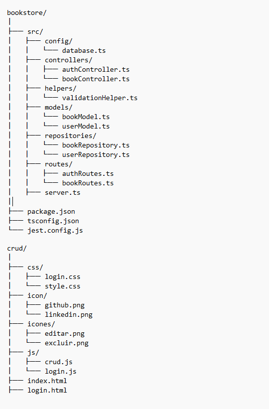

## Projeto: Bookstore

Este é um projeto de sistema de gerenciamento de livros, desenvolvido em TypeScript. Ele inclui operações CRUD (criação, leitura, atualização e exclusão) e interações com uma API externa. O sistema foi criado com o objetivo de oferecer uma solução organizada para gerenciar um catálogo de livros, com integração a APIs externas e testes automatizados.

-------------------------------------- **Grupo** --------------------------------------
• Hiago Damasceno - 53448
• Giovanna Lourenço - 56052
• Guilherme Jose Dias - 56327
• Maria Eduarda Macedo - 63339
• Marizelia Cardoso - 52628
-------------------------------------- **Requisitos** --------------------------------------

-------------------------------------- **Funcionais** --------------------------------------

1. Cadastro de livros**: Permite a criação de novos livros no sistema.
2. Leitura de livros**: Exibe os detalhes dos livros cadastrados.
3. Edição de livros**: Permite a atualização das informações dos livros.
4. Exclusão de livros**: Permite a remoção de livros do sistema.
5. Interação com API externa**: Realiza chamadas a uma API de livros para obter ou atualizar dados.
6. Testes automatizados**: A aplicação inclui testes unitários e de integração para garantir a funcionalidade do código.

-------------------------------------- **Não Funcionais** --------------------------------------

1. Desempenho**: O sistema deve ser capaz de processar requisições em tempo hábil para uma experiência de usuário ágil.
2. Escalabilidade**: A estrutura do código foi pensada para facilitar futuras atualizações e integrações.
3. Segurança**: Utilização de boas práticas de desenvolvimento para minimizar riscos de segurança.
4. Manutenção**: O projeto está estruturado de forma modular, com organização em pastas específicas para controladores, modelos, repositórios, etc.
5. Testabilidade**: O código foi escrito de forma que suporte testes automatizados com o Jest.

-------------------------------------- **Tecnologias Utilizadas** --------------------------------------

- Node.js**: Ambiente de execução de JavaScript.
- Express**: Framework para criação de servidores web.
- pg**: Cliente PostgreSQL para interação com banco de dados.
- dotenv**: Gerenciamento de variáveis de ambiente.
- TypeScript**: Linguagem para desenvolvimento com tipagem estática.
- Jest**: Framework para testes unitários e de integração.
- Supertest**: Biblioteca para testes de integração de endpoints.

-------------------------------------- **Instalação** --------------------------------------

1. **Instale as dependências**

**Primeiro, inicialize o projeto com o comando:**

bash
npm init -y

**Em seguida, instale as dependências principais:**

bash
npm install express pg dotenv

**E as dependências de desenvolvimento:**

bash
npm install --save-dev typescript jest @types/jest ts-jest supertest @types/express

2. **Execute o servidor**

**Utilize o npx para rodar o servidor de forma simplificada:**

bash
npx ts-node ./bookstore/src/server.ts

-------------------------------------- **Estrutura de Pastas** --------------------------------------

</img>

-------------------------------------- **Conclusão** --------------------------------------

Esse projeto é uma solução robusta para gerenciar um catálogo de livros com suporte a operações CRUD e testes automatizados. Siga as instruções de instalação e execute o servidor para começar a utilizá-lo.

